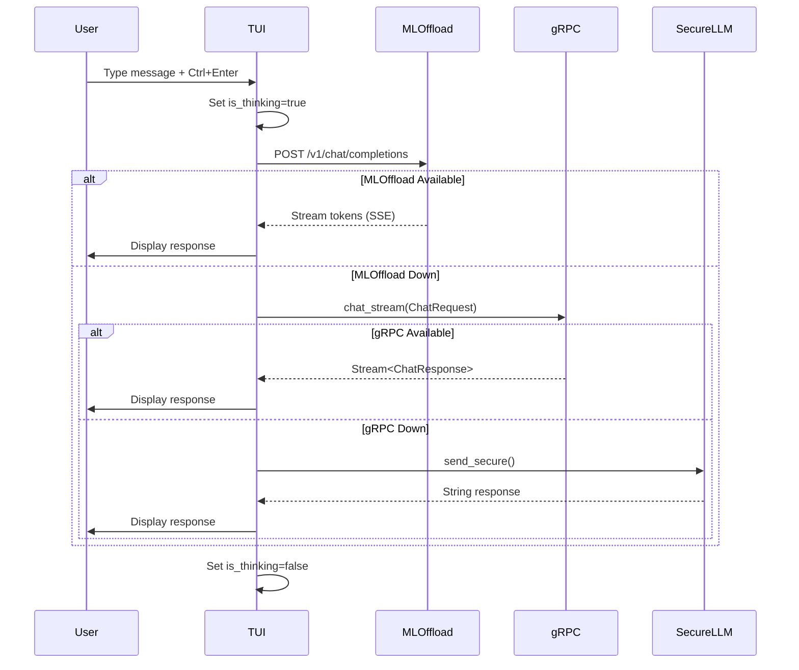

# Neoland Architecture

**Document Version**: 2.0  
**Last Updated**: 2026-01-18

This document provides a technical deep-dive into Neoland's architecture, design patterns, and integration strategies.

> Current status note (2026-05-17): this file is historical architecture
> context. For the current mapped topology, ports, status, and release blockers,
> use [`neoland-project-snapshot.md`](neoland-project-snapshot.md),
> [`neoland-progress.md`](neoland-progress.md), and
> [`roadmaps/neoland-llm-runtime-roadmap.md`](roadmaps/neoland-llm-runtime-roadmap.md).

---

## Table of Contents

1. [System Overview](#system-overview)
2. [Module Architecture](#module-architecture)
3. [LLM Inference Pipeline](#llm-inference-pipeline)
4. [Data Flow](#data-flow)
5. [Integration Mechanisms](#integration-mechanisms)
6. [Design Patterns](#design-patterns)
7. [Future: Neutron Integration](#future-neutron-integration)

---

## System Overview

### Technology Stack

| Layer             | Technology                  | Purpose                     |
| ----------------- | --------------------------- | --------------------------- |
| **CLI**           | `clap` 4.5                  | Argument parsing            |
| **TUI**           | `ratatui` 0.28              | Terminal rendering          |
| **Input**         | `crossterm` 0.28            | Cross-platform terminal I/O |
| **RPC**           | `tonic` 0.12 + `prost` 0.13 | gRPC server/client          |
| **REST**          | `axum` 0.7                  | HTTP API                    |
| **HTTP Client**   | `reqwest` 0.12              | External API calls          |
| **Async Runtime** | `tokio` 1.40                | async/await executor        |
| **Inference**     | `candle` 0.8                | Pure Rust ML framework      |
| **Build**         | Nix Flakes                  | Reproducible builds         |

### Deployment Models

1. **Standalone**: Single binary with embedded inference
2. **Client-Server**: TUI client + gRPC server
3. **Distributed**: Client → ml-offload-api → multi-backend

---

## Module Architecture

### Server Module (`src/server/mod.rs`)

**Responsibilities**:

- gRPC service implementation (`LlamaService`)
- REST API endpoints (OpenAI-compatible)
- Concurrent server management (tokio::select!)
- State management (Arc<Mutex<>>)

**Key Components**:

```rust
pub struct AppState {
    engine: Arc<Mutex<Option<LocalEngine>>>,      // Lazy-loaded inference
    vector_store: Arc<Mutex<VectorStore>>,        // RAG embeddings
}

#[tonic::async_trait]
impl LlamaService for MyLlamaService {
    type ChatStreamStream = ReceiverStream<Result<ChatResponse, Status>>;

    async fn chat_stream(&self, req: Request<ChatRequest>)
        -> Result<Response<Self::ChatStreamStream>, Status>;
}
```

**Design Pattern**: Repository pattern for state isolation.

### TUI Module (`src/tui/`)

**Architecture**: Model-View-Controller (MVC)

```
app.rs (Model)
  ├── AppState - Core state
  ├── ChatMessage - Message data
  └── QueryConfig - Inference params

ui.rs (View)
  ├── render() - Main render loop
  ├── render_header() - Status bar
  ├── render_chat() - Message list
  ├── render_sidebar() - Config panel
  └── render_input() - Input field

events.rs (Controller)
  ├── handle_events() - Input routing
  └── AppEvent enum - Action commands

mod.rs (Coordinator)
  ├── run_client() - Event loop
  └── send_message_to_server() - API logic
```

**State Management**:

```rust
pub struct AppState {
    messages: Vec<ChatMessage>,
    input_buffer: String,
    config: QueryConfig,http://127.0.0.1:39599/webview/agentic-duo-chat?mode=flow-mode&_csrf=wxdUnrBS-PSKvagv6fMbPfj6fgPsoEeUiyJgZVokGRhbTc757A-g#
    sidebar_visible: bool,
    server_url: String,
    ml_api_url: String,      // Configurable endpoint
    scroll_offset: usize,
    is_thinking: bool,       // UI feedback flag
}
```

### ML Offload Module (`src/ml_offload/`)

**Purpose**: Client for external ML orchestration service.

**OpenAI Compatibility Layer**:

```rust
pub struct ChatCompletionRequest {
    model: String,              // "auto" for backend selection
    messages: Vec<ChatMessage>,
    temperature: Option<f32>,
    max_tokens: Option<u32>,
    stream: Option<bool>,       // SSE support
}
```

**HTTP Client**:

```rust
impl MLOffloadClient {
    pub async fn chat_completion(&self, req: ChatCompletionRequest)
        -> Result<ChatCompletionResponse>;

    pub async fn health(&self) -> Result<HealthStatus>;
    pub async fn list_models(&self) -> Result<ModelsListResponse>;
}
```

### LLM Module (`src/llm/`)

**Purpose**: SecureLLM integration for audited external providers.

**Security Proxy**:

```rust
pub struct SecureLLMProxy {
    // Future: Provider pooling, circuit breaker
}

impl SecureLLMProxy {
    pub async fn send_secure(&self, message: String) -> Result<String> {
        // 1. Build securellm_core::Request
        // 2. Apply rate limiting
        // 3. Log request (audit trail)
        // 4. Send to provider
        // 5. Validate response
    }
}
```

---

## LLM Inference Pipeline

### Fallback Chain Implementation

```rust
async fn send_message_to_server(app: &mut AppState) -> Result<()> {
    let message = app.input_buffer.clone();
    app.add_user_message(&message);

    // === LAYER 1: ml-offload-api ===
    let ml_client = MLOffloadClient::new(app.ml_api_url.clone());

    if ml_client.health().await.is_ok() {
        match ml_client.chat_completion(request).await {
            Ok(response) => return Ok(()),
            Err(e) => log_warning(e),
        }
    }

    // === LAYER 2: gRPC Internal ===
    let mut grpc_client = LlamaServiceClient::connect(app.server_url.clone()).await?;
    match grpc_client.chat_stream(grpc_request).await {
        Ok(stream) => return Ok(()),
        Err(e) => log_error(e),
    }

    // === LAYER 3: SecureLLM Proxy ===
    let proxy = SecureLLMProxy::new();
    let response = proxy.send_secure(message).await?;
    app.add_assistant_message(&response);

    Ok(())
}
```

**Rationale**: Prioritize speed (GPU) → reliability (local) → coverage (external).

---

## Data Flow

### Client-Initiated Chat



### gRPC Protocol Buffer

```protobuf
message ChatRequest {
  string prompt = 1;
  string model_id = 2;
  bool use_local = 3;
  optional float temperature = 4;
  optional int32 max_tokens = 5;
  // ... 11 additional sampling params
}

message ChatResponse {
  string content = 1;
  bool is_command = 2;
  optional ResponseMetadata metadata = 3;
}
```

---

## Integration Mechanisms

### Hyprland IPC

**Implementation**: External crate (`hyprland-ipc`).

**NixOS Declaration**:

```nix
wayland.windowManager.hyprland.extraConfig = ''
  # Neoland scratchpad
  windowrulev2 = float, class:^(neoland-client)$
  windowrulev2 = size 1400 900, class:^(neoland-client)$
  windowrulev2 = center, class:^(neoland-client)$
  windowrulev2 = opacity 0.95, class:^(neoland-client)$
  windowrulev2 = workspace special:neoland, class:^(neoland-client)$

  bind = SUPER, N, togglespecialworkspace, neoland
'';
```

**Runtime IPC**:

```rust
use hyprland_ipc::HyprlandClient;

let client = HyprlandClient::new()?;
client.dispatch("togglespecialworkspace neoland").await?;
```

### Agent Hub Integration

**Launcher Script** (`agent-hub.nix`):

```bash
"󰜈 Neoland - AI Agent")
  alacritty --class="neoland-client" \
    -e neoland client \
    --ml-api-url http://${llamaCppApi.host}:${toString llamaCppApi.port} &
  ;;
```

**Status Check**:

```bash
pgrep -f "neoland (server|client)" > /dev/null && echo "🟢 Running" || echo "🔴 Stopped"
```

---

## Design Patterns

### 1. Builder Pattern (CLI)

```rust
#[derive(Parser)]
#[command(name = "neoland")]
pub struct Cli {
    #[command(subcommand)]
    pub command: Commands,

    #[arg(long, global = true, default_value = "info")]
    pub log_level: String,
}
```

### 2. State Machine (TUI Events)

```rust
pub enum AppEvent {
    Quit,
    SendMessage,
    ClearChat,
    ApplyPreset(String),
    ToggleSidebar,
    ScrollUp,
    ScrollDown,
}

match event {
    AppEvent::SendMessage => {
        app.is_thinking = true;
        terminal.draw(|f| render(f, &app))?;
        send_message_to_server(&mut app).await?;
        app.is_thinking = false;
    }
    // ...
}
```

### 3. Repository Pattern (Server State)

```rust
pub struct AppState {
    engine: Arc<Mutex<Option<LocalEngine>>>,  // Lazy init
    vector_store: Arc<Mutex<VectorStore>>,    // Shared state
}

// Thread-safe access
let mut engine_guard = state.engine.lock().unwrap();
if engine_guard.is_none() {
    *engine_guard = Some(LocalEngine::new()?);
}
```

### 4. Adapter Pattern (ML Offload)

OpenAI-compatible interface adapts to internal data structures:

```rust
// External format
pub struct ChatMessage {
    pub role: String,       // "user" | "assistant" | "system"
    pub content: String,
}

// Internal format
pub struct ChatMessage {
    pub role: MessageRole,  // enum
    pub content: String,
    pub timestamp: DateTime<Utc>,  // Added context
}
```

---

## Future: Neutron Integration

### Vision

**Neutron** is a distributed trust layer for AI systems, ensuring:

1. **Data Provenance**: Cryptographic proof of training data origins
2. **Model Integrity**: Tamper-proof audit logs and version control
3. **Inference Accountability**: Zero-knowledge proofs for sensitive queries

### Proposed Architecture

```rust
// src/neutron/mod.rs
pub mod provenance;
pub mod consensus;
pub mod zkp;

pub struct NeutronClient {
    attestation_service: AttestationClient,
    consensus_pool: ConsensusNode,
    zkp_engine: ZKPVerifier,
}

impl NeutronClient {
    /// Verify training data lineage
    pub async fn verify_provenance(&self, model_id: &str)
        -> Result<ProvenanceChain>;

    /// Submit inference to distributed audit log
    pub async fn audit_inference(&self, request: &Request, response: &Response)
        -> Result<AuditReceipt>;

    /// Generate ZKP for sensitive inference
    pub async fn zkp_inference(&self, private_input: &str)
        -> Result<(PublicOutput, Proof)>;
}
```

### Integration Points

#### 1. ml-offload-api Attestation

```rust
// Before forwarding request to backend
let attestation = neutron_client
    .verify_backend(&backend_url)
    .await?;

if !attestation.is_valid() {
    return Err("Untrusted backend");
}
```

#### 2. SecureLLM Audit Trail

```rust
// After external provider response
let receipt = neutron_client
    .audit_inference(&request, &response)
    .await?;

// Store immutable audit log
save_to_blockchain(receipt);
```

#### 3. Vector Store Source Verification

```rust
impl VectorStore {
    pub async fn add_document_verified(
        &mut self,
        content: &str,
        neutron_client: &NeutronClient
    ) -> Result<()> {
        // Verify document source
        let provenance = neutron_client
            .verify_document_source(content)
            .await?;

        self.add_document(content, &provenance.serialize())?;
        Ok(())
    }
}
```

### Threat Model

**Mitigated Risks**:

- 🛡️ Poisoned training data injection
- 🛡️ Model weight tampering
- 🛡️ Inference result manipulation
- 🛡️ Unauthorized data access

**Implementation Timeline**:

- Q2 2026: Provenance module (Phase 1)
- Q3 2026: Consensus layer (Phase 2)
- Q4 2026: ZKP engine (Phase 3)

### Dependencies

```toml
# Future Cargo.toml additions
neutron-core = { path = "../neutron/crates/core" }
zkp-stark = "0.3"                    # Zero-knowledge proofs
blockchain-client = "1.0"            # Audit log persistence
attestation-service = "0.5"          # Remote attestation
```

---

## Performance Optimization

### Current Bottlenecks

1. **Inference**: CPU-bound (Qwen 1.8B @ 5 tok/s)
   - **Solution**: ml-offload-api with GPU backend
2. **Startup**: Model loading (~2s cold start)
   - **Solution**: Lazy initialization in server

3. **Memory**: VectorStore grows unbounded
   - **Future**: LRU eviction policy

### Benchmarks

```bash
# TUI rendering latency
hyperfine --warmup 3 './target/release/neoland client'
# Mean: 42ms ± 5ms

# gRPC throughput
ghz --insecure --proto proto/llamachat.proto \
  --call llamachat.LlamaService/ChatStream \
  -d '{"prompt":"test"}' \
  --total 1000 \
  localhost:50051
# RPS: ~150 (single-threaded server)
```

---

## Security Considerations

### Current Measures

1. **Input Validation**: All CLI args sanitized via `clap`
2. **Command Filtering**: Whitelist for `[[CMD:]]` execution
3. **TLS**: gRPC supports TLS (disabled in dev)

### Future Hardening

1. **Neutron Integration**: Cryptographic verification
2. **Rate Limiting**: Per-user quotas
3. **Sandboxing**: Isolate inference in separate process

---

## References

- [Rust Async Book](https://rust-lang.github.io/async-book/)
- [Tonic gRPC Guide](https://github.com/hyperium/tonic)
- [Ratatui Documentation](https://ratatui.rs/)
- [Candle ML Framework](https://github.com/huggingface/candle)

---

**Maintained by**: VoidNxSEC Architecture Team  
**Review Cycle**: Quarterly
