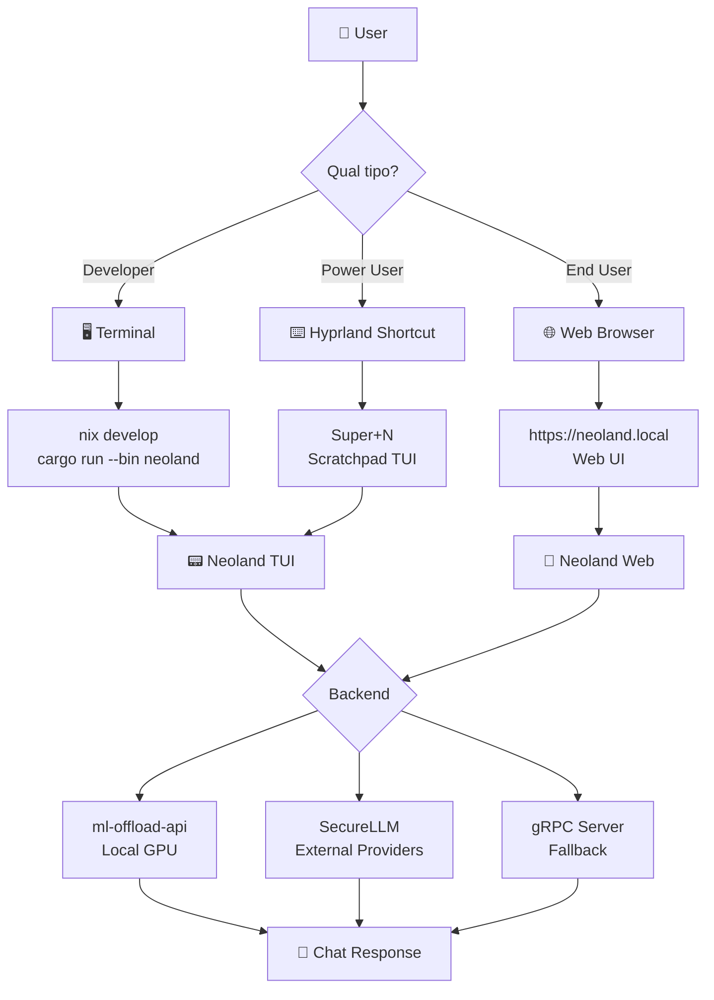
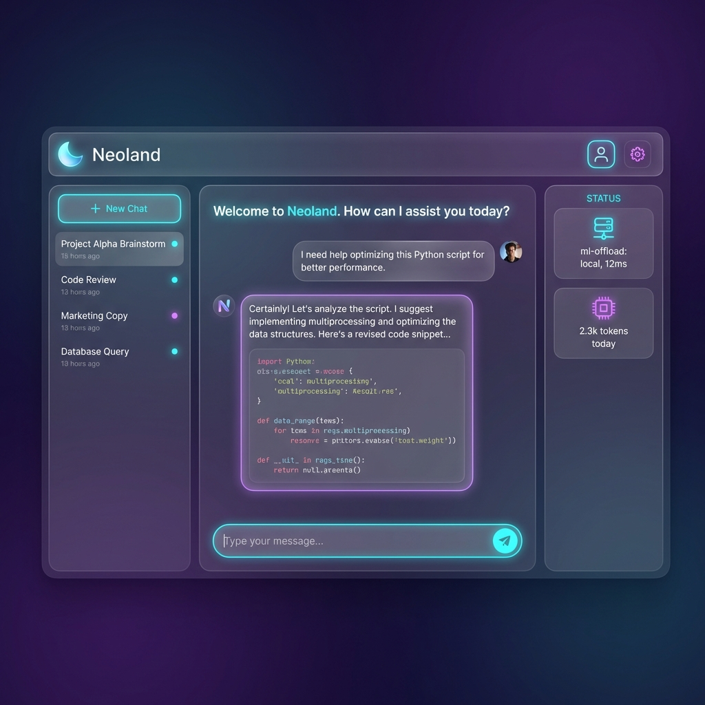
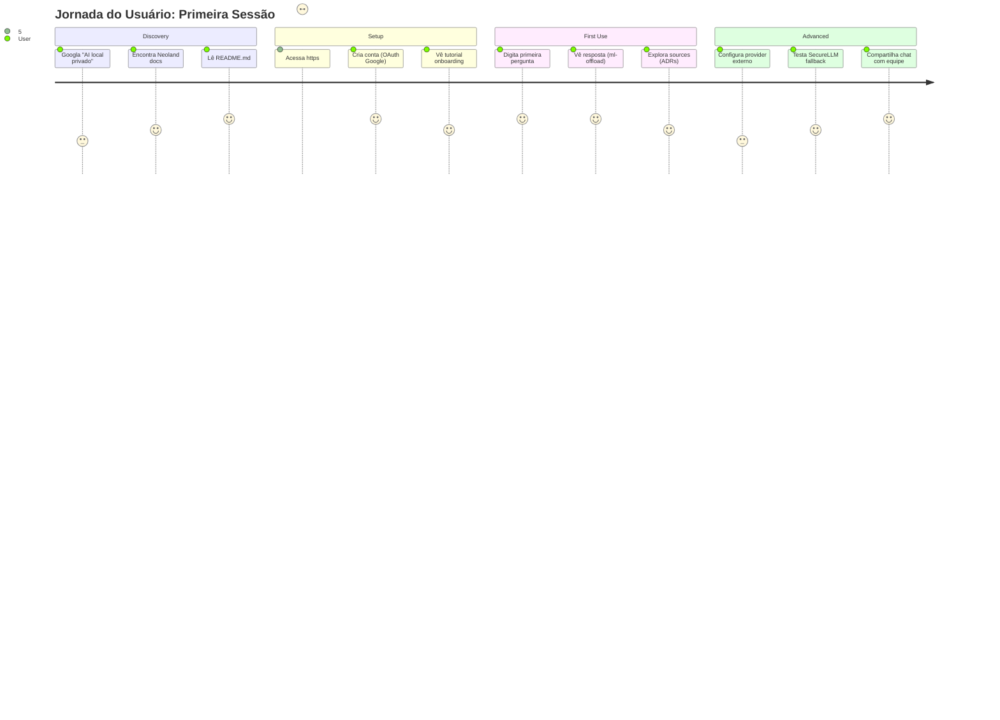
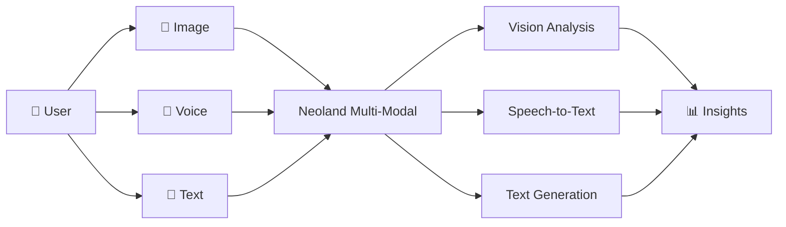

# Neoland - Product Vision & User Journey

> **Visão de Produto**: Tornar IA local acessível e visual para usuários não-técnicos

> Current status note (2026-05-17): use this as aspirational product context.
> The current delivery target is the responsible public pre-release tracked in
> [`neoland-roadmap.md`](neoland-roadmap.md), with the workbench and TUI focused
> on verified operator/code-task flows first.

---

## 🎯 O Problema

**Backend poderoso, UX invisível**: Temos uma stack técnica robusta (ml-offload, securellm, neutron), mas o usuário comum não vê valor porque a interface é CLI/código.

**Gap**: Precisamos de **camadas visuais** que exponham a capacidade técnica de forma acessível.

---

## 👤 Personas de Usuário

### 1. **Developer (Atual)**

- **Acesso**: CLI, TUI, código direto
- **Workflow**: `nix develop` → `cargo run`
- **Value**: Controle total, extensibilidade

### 2. **Power User (Target Q2 2026)**

- **Acesso**: TUI + shortcuts Hyprland
- **Workflow**: `Super+N` → chat interface
- **Value**: Velocidade, integração OS

### 3. **End User (Target Q3 2026)**

- **Acesso**: Web UI, mobile app (futuro)
- **Workflow**: Browser → login → chat
- **Value**: Simplicidade, zero setup

---

## 🚪 Pontos de Entrada do Usuário



---

## 🎨 UI Evolution Roadmap

### **v0.2.0 - TUI (Now)** ✅

**Target**: Developers + Power Users

**Interface**: Terminal-based (ratatui)

```
┌─────────────────────────────────────────────────────────┐
│ 🚀  Neoland TUI | http://[::1]:50051 | ✅  Ready       │
└─────────────────────────────────────────────────────────┘
┌ 💬  Chat ───────────────────────┐┌ ℹ️  Info ──────────┐
│[16:13] ⚙️  SYSTEM               ││📊  Config          │
│🚀  Neoland TUI iniciado          ││Temperature: 0.70   │
│                                 ││Top P: 0.90         │
│[16:14] 👤  USER                 │└────────────────────┘
│Qual o status do sistema?        │
│                                 │
│[16:14] 🤖  ASSISTANT            │
│Status: ✅ ml-offload (10ms)     │
│Backend: Ollama (llama3.2-1b)   │
└─────────────────────────────────┘
┌ ✏️  Input (Ctrl+Enter) ─────────────────────────────────┐
│ █                                                       │
```

**Acesso**:

```bash
# Método 1: CLI direto
nix develop --command cargo run --bin neoland -- client

# Método 2: Hyprland shortcut (Super+N)
# Configurado em ~/.config/hypr/hyprland.conf
```

---

### **v0.3.0 - Web UI (Q2 2026)** 🚧

**Target**: End Users

**Interface**: Next.js/React web app

**Mockup Conceitual**:



**Descrição da Interface**:

```
┌────────────────────────────────────────────────────────────────┐
│  🌙 Neoland                        👤 user@local    ⚙️ Settings │
├────────────────────────────────────────────────────────────────┤
│                                                                │
│  💬 New Chat                                                   │
│                                                                │
│  ┌──────────────────────────────────────────────────────────┐ │
│  │                                                          │ │
│  │  👤 You • 2m ago                                         │ │
│  │  What are the architecture decisions for Neoland?       │ │
│  │                                                          │ │
│  │  🤖 Neoland • 2m ago                                     │ │
│  │  Based on ADR-002 (LocalFirst Strategy), we prioritize: │ │
│  │  1. ml-offload-api (10-50ms latency)                    │ │
│  │  2. SecureLLM fallback (200-500ms, audited)             │ │
│  │                                                          │ │
│  │  📎 Sources: ADR-002, ADR-003                            │ │
│  │                                                          │ │
│  └──────────────────────────────────────────────────────────┘ │
│                                                                │
│  ┌──────────────────────────────────────────────────────────┐ │
│  │  Type your message...                          [Send] 🚀 │ │
│  └──────────────────────────────────────────────────────────┘ │
│                                                                │
│  ⚡ Status: ml-offload (local, 12ms) | 📊 2.3k tokens today   │
└────────────────────────────────────────────────────────────────┘
```

**Tech Stack**:

- **Frontend**: Next.js 15 + TypeScript + Tailwind
- **Backend**: Neoland gRPC-web bridge
- **Auth**: OAuth2 (Google/GitHub) + local accounts
- **Deploy**: Docker + Kubernetes

**Acesso**:

```bash
# Development
cd neoland-web
npm run dev  # http://localhost:3000

# Production
docker-compose up -d  # https://neoland.local
```

---

### **v0.4.0 - Desktop App (Q3 2026)** 🔮

**Target**: Power Users sem Hyprland

**Interface**: Tauri (Rust + Web UI)

**Features**:

- Native window management
- System tray integration
- Offline mode
- Cross-platform (Linux, macOS, Windows)

**Acesso**:

```bash
# Install via Nix
nix profile install github:marcosfpina/neoland#desktop

# Launch
neoland-desktop
```

---

## 🔄 User Journey - típico End User (v0.3.0)



---

## 📊 Feature Comparison: TUI vs Web UI

| Feature           | TUI (v0.2.0)      | Web UI (v0.3.0)  |
| ----------------- | ----------------- | ---------------- |
| **Startup**       | <50ms             | ~2s (cold start) |
| **Memory**        | 15MB              | ~150MB           |
| **Audience**      | Devs, Power Users | Everyone         |
| **Auth**          | None (local)      | OAuth2 + RBAC    |
| **Sharing**       | Git commit logs   | Share URLs       |
| **Mobile**        | ❌                | ✅ (responsive)  |
| **Offline**       | ✅                | ⚠️ (PWA cache)   |
| **Theming**       | Tokyo Night       | Light/Dark/Auto  |
| **Accessibility** | Screen readers    | WCAG 2.1 AA      |

---

## 🎯 Business Model (Enterprise focus)

### **Free Tier** (Self-hosted)

```
User → Neoland TUI/Web (self-hosted) → ml-offload (own GPU)
       ↓
       Free forever, full OSS
```

### **Pro Tier** ($49/month)

```
User → Neoland Cloud (managed) → ml-offload (our GPU cluster)
       ↓
       + 10k requests/month
       + Priority support
       + Advanced analytics
```

### **Enterprise Tier** (Custom)

```
User → Neoland Cloud (tenant) → Spectre (multi-tenant)
       ↓
       + Unlimited requests
       + SOC2 compliance
       + SSO/LDAP integration
       + 99.99% SLA
```

---

## 🚀 Go-to-Market Strategy

### **Phase 1: Developer Community** (Now)

- **Channel**: GitHub, Hacker News, Reddit (r/selfhosted)
- **Value Prop**: "Open-source ChatGPT alternative with your own GPU"
- **CTA**: Star repo, contribute ADRs

### **Phase 2: Power Users** (Q2 2026)

- **Channel**: YouTube (tutorial videos), Twitter
- **Value Prop**: "Privacy-first AI assistant for Hyprland/i3 users"
- **CTA**: Download Nix package, customize keybindings

### **Phase 3: Enterprise** (Q3 2026)

- **Channel**: LinkedIn, enterprise sales
- **Value Prop**: "Compliant, auditable AI for Fortune 500"
- **CTA**: Schedule demo, pilot program

---

## 💡 Visual Mockups Prioritários

### 1. **Landing Page Hero** (Marketing)

```
┌────────────────────────────────────────────────────────┐
│                                                        │
│         🌙 Neoland                                     │
│         Your Private AI Assistant                      │
│                                                        │
│         ✅ Local-first (your GPU)                      │
│         ✅ Open source (MIT)                           │
│         ✅ Enterprise-ready (SOC2)                     │
│                                                        │
│    [Try Demo]  [Read Docs]  [Star on GitHub ⭐ 2.3k]  │
│                                                        │
│    Screenshot: TUI in action                           │
│                                                        │
└────────────────────────────────────────────────────────┘
```

### 2. **Dashboard (Web UI)** (Product)

```
┌────────────────────────────────────────────────────────┐
│  Sidebar          Main Chat              Insights      │
│  ─────────        ──────────             ────────      │
│  💬 Chats         [Active conversation]  📊 Stats      │
│  📄 Docs          ...                    • 150 msgs    │
│  ⚙️ Settings      ...                    • 3.2k tokens │
│  👥 Team          ...                    • $0.05 cost  │
└────────────────────────────────────────────────────────┘
```

---

## 🔮 Futuro: Multi-Modal (2027+)



**Use Cases**:

- Screenshot → code generation
- Voice → meeting notes
- Image + Text → creative content

---

## 📈 Success Metrics (KPIs)

| Metric                    | Current (v0.2.0) | Target (v0.3.0) | Target (v0.4.0) |
| ------------------------- | ---------------- | --------------- | --------------- |
| **GitHub Stars**          | ~50              | 1,000           | 5,000           |
| **Active Users**          | 5 (internal)     | 100             | 1,000           |
| **Contributors**          | 2                | 10              | 25              |
| **Docs Traffic**          | 50/month         | 10k/month       | 50k/month       |
| **Conversion (Free→Pro)** | N/A              | 2%              | 5%              |

---

**Maintained by**: VoidNxSEC Team  
**Last Updated**: 2026-01-18
