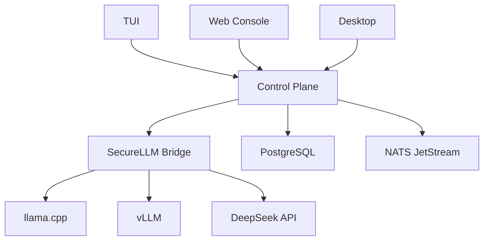

# Neoland v0.0.1 — Video Demo Storyboard

**Duration**: 4-5 minutos  
**Style**: Terminal-first, dark theme, scanlines overlay, synthwave/lo-fi background  
**Recording**: OBS Studio + terminal (Kitty/Alacritty) + Chromium (Web Console)

---

## Scene 1 — Cold Open (15s)

**Visual**: Black screen. Cursor blinks. Terminal prompt appears.

```
$ neoland chat
```

Text fades in: "What if your infrastructure could document its own decisions?"

Cut to title card:

```
╔══════════════════════════════════════╗
║  N E O L A N D   v 0 . 4 . 0        ║
║  Autonomous AI Engineering Platform  ║
╚══════════════════════════════════════╝
```

---

## Scene 2 — The TUI (60s)

**Visual**: Split screen — left: terminal TUI, right: Web Console (same session).

### 2a. TUI Layout
Show the 3-column layout:
- **Left**: Sessions panel (ADR-001, ADR-002, ADR-003...)
- **Center**: Conversation panel (chat bubbles, code blocks)
- **Right**: Reasoning panel (pipeline tree)

```
┌─Sessions──┬─Conversation────────────────────┬─Reasoning──────┐
│ ADR-001   │                                 │ Pipeline       │
│ ADR-002   │  User: Design auth system for   │                │
│ ADR-003 ● │  multi-tenant SaaS platform     │ Junior    ████ │
│           │                                 │ Senior    ██   │
│           │  Agent: ## ADR-014               │ Architect █    │
│           │  Authentication Architecture     │ Tech-Lead ████ │
│           │                                 │                │
│           │  ### Context                     │ Confidence     │
│           │  We need to support OAuth2 +     │ ████████ 0.94  │
│           │  SSO for enterprise...           │                │
│           │  [streaming...]                  │ RWA Anchor     │
│           │                                  │ 0x7f3a...b29c  │
└───────────┴─────────────────────────────────┴────────────────┘
│ /help  /provider  /theme  /search  /agent           [Send] │
```

### 2b. Theme Switch
Type `/theme neon-glass` — the UI instantly changes to a glowing synthwave palette.

### 2c. Command System
Show `/help` output, then demonstrate:
- `/provider deepseek` — switches inference provider
- `/search kubernetes ingress` — searches local vector store

### 2d. Pipeline Visualization
Highlight the reasoning panel:
- Each stage shows confidence as a progress bar
- The RWA anchor (Real-World Anchor) is a Merkle hash at the bottom
- Demonstrates audit trail immutability

**VO**: "Every ADR is produced by a 4-stage agent pipeline — Junior drafts, Senior refines, Architect validates, Tech-Leader signs off. Each stage is checkpointed and anchored to a Merkle chain. The decision is auditable forever."

---

## Scene 3 — Web Console (45s)

**Visual**: Chromium window, dark terminal theme.

### 3a. Login Flow
Show OAuth2 login:
```
→ Click "Login with Google"
→ Google OAuth consent screen (blur email)
→ Redirect back to Neoland
→ Dashboard loads with session list
```

### 3b. SSE Streaming
Type a prompt in the Web Console:
> "Write an ADR for deploying Neoland on Kubernetes with mTLS"

Show tokens streaming in real-time via Server-Sent Events. Highlight:
- Typewriter animation as tokens arrive
- Pipeline tree updating live in the reasoning panel
- Confidence scores adjusting as stages complete

### 3c. PWA
Show "Install" prompt in browser address bar. Click install. Neoland appears as a standalone window with its own icon.

**VO**: "The Web Console is a Leptos SPA compiled to WebAssembly. Zero JavaScript. 600 lines of CSS. It streams responses via SSE, works offline as a PWA, and looks identical to the native desktop app."

---

## Scene 4 — Desktop App (20s)

**Visual**: Tauri desktop window on Linux (or macOS).

- Show system tray icon → right-click → "Show/Hide/Quit"
- Native notification: "ADR-015 completed — confidence 0.97"
- The desktop window shows the same Web Console UI (it reuses the WASM bundle)

**VO**: "Same UI, native window. Tauri wraps the Leptos WASM bundle with system tray integration and OS notifications. One codebase, three surfaces."

---

## Scene 5 — Architecture Deep-Dive (40s)

**Visual**: Mermaid diagram with animated arrows.



Narrate each component, then zoom into the routing layer:

### 5a. Multi-Backend Routing
Show terminal output:
```
$ neoland doctor
 Backend          Status     Latency    Circuit
 ─────────────────────────────────────────────
 ml-offload       ● Healthy   12ms      Closed
 vllm             ● Healthy   89ms      Closed
 securellm        ● Healthy  234ms      Closed

 Routing: Adaptive
 Last classified: CodeGen → vLLM
```

**VO**: "Neoland routes every prompt through an adaptive classifier. Short real-time queries hit the local model. Code generation hits vLLM on the GPU cluster. General knowledge goes to the cloud provider. All with circuit breakers and automatic fallback."

---

## Scene 6 — Deployment (30s)

**Visual**: Split terminal — left: `helm install`, right: `kubectl get pods -w`.

```bash
# Left terminal
$ helm install neoland ./deploy/helm/neoland \
    --set auth.oidc.issuer=https://login.microsoftonline.com/tenant/v2.0 \
    --set ingress.host=neoland.example.com

NAME: neoland
STATUS: deployed

# Right terminal
$ kubectl get pods -w
NAME                       READY   STATUS
neoland-7d4f8b9c-abcde     0/1     Pending
neoland-7d4f8b9c-abcde     0/1     Init:0/1
neoland-7d4f8b9c-abcde     0/1     PodInitializing
neoland-7d4f8b9c-abcde     1/1     Running
neoland-7d4f8b9c-fghij     1/1     Running
neoland-7d4f8b9c-klmno     1/1     Running
```

**VO**: "One Helm command deploys the full stack — 3 replicas, auto-scaling to 10, PostgreSQL with pgvector, NATS JetStream for event streaming, and mTLS between every service. Production-ready in under a minute."

---

## Scene 7 — Closing (15s)

**Visual**: Return to the title card, then fade to:

```
╔══════════════════════════════════════╗
║  github.com/VoidNxSEC/neoland       ║
║                                      ║
║  MIT License · Open Source           ║
║  100% Rust · Nix reproducible        ║
╚══════════════════════════════════════╝

       Star it. Fork it. Ship ADRs.
```

---

## Production Notes

### Recording Setup
- **Terminal**: Kitty with IBM Plex Mono, 14pt, Tokyo Night theme
- **TUI recording**: `asciinema rec` for terminal sections (editable, small file)
- **Browser**: Chromium 128+, 1280×720 window, dark reader mode off
- **Screen recorder**: OBS Studio, 1920×1080, 30fps
- **Post**: DaVinci Resolve for cuts, transitions, text overlays

### Audio
- **VO**: Record clean in Audacity, noise reduction, compress 2:1
- **Background**: Lo-fi instrumental (royalty-free from Epidemic Sound / Artlist)
- **SFX**: Subtle keyboard clicks on typing scenes, soft "whoosh" on transitions

### Key Messages (must land)
1. **100% Rust** — no Python, no Node, no Envoy
2. **4-stage agent pipeline** — Junior → Senior → Architect → Tech-Leader
3. **Multi-backend routing** — local, GPU, cloud, automatic
4. **Enterprise auth** — OAuth2, SSO, LDAP, RBAC
5. **Production deployment** — `helm install`, 3 replicas, mTLS
6. **Open source** — MIT, reproducible Nix builds

### B-Roll (optional, for longer version)
- `nix flake show` — deterministic dependency tree
- `cargo test --lib` — 298 tests passing in <1s
- `cargo build --release` — single 18MB binary
- `just smoke` — end-to-end smoke test completing
- OpenAPI Swagger UI at `/swagger-ui/`
- Grafana dashboard with Prometheus metrics
