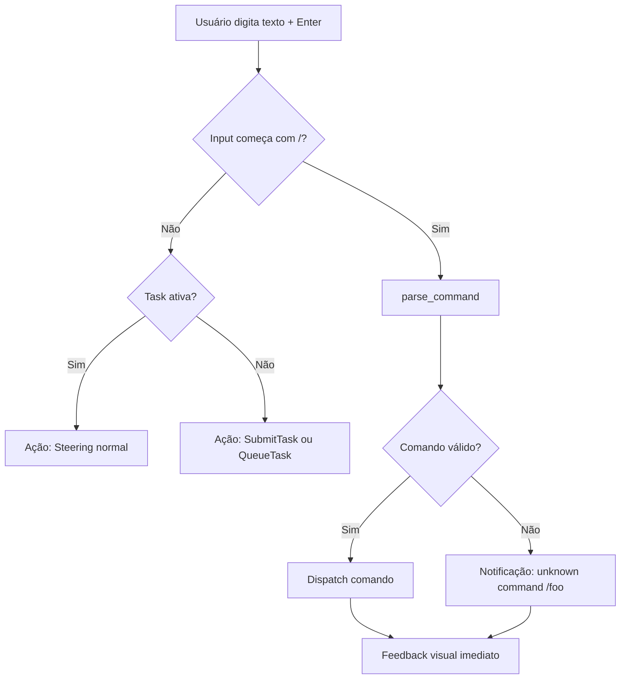

## 


# Plano: TUI UX Improvements — Neoland

**Status**: Planejamento
**Versão**: 2.1
**Baseado em**: discussão com usuário sobre transparência peer-to-peer, participação ativa e ambiente controlado para criatividade

---

## Filosofia: Colaboração Ativa — O Usuário como Senior/PM

> "O usuário participa ativamente do progresso do projeto, ele é como um senior ou PM chato."
>
> "Tecnicamente é um ambiente controlado onde a fricção é reduzida e a criatividade é devolvida."

O Neoland TUI não é um dashboard passivo. É o **canal de comunicação** entre o pipeline multi-agente e o usuário, que atua como **senior/PM do time** — questionando, redirecionando, aprovando e rejeitando em tempo real.

O pipeline (junior → senior → architect → tech-leader) não é um processo oculto que entrega resultados. É um **time** onde o usuário participa de cada etapa relevante.

### O Papel do Usuário

| Papel | Ação no TUI |
|-------|-------------|
| **Questionar** | "Por que você escolheu essa abordagem?" → `/why` mostra reasoning |
| **Redirecionar** | "Não vai por esse caminho, vai por este" → `/steer` a qualquer momento |
| **Aprovar/Rejeitar** | "Pode continuar" / "Isso está errado" → breakpoints + steering |
| **Priorizar** | "Faz essa task primeiro" → queue management |
| **Corrigir** | "Sua premissa está incorreta" → `/steer` com correção |

### Princípios de Design

#### P0. Colaboração, Não Observação

O TUI não existe para "mostrar o que aconteceu". Existe para **permitir que o usuário participe do que está acontecendo**.

- O pipeline expõe **hypotheses, decisões e riscos** em cada etapa — não só resultados
- O usuário pode **intervir** a qualquer momento com `/steer` — como um senior falando "vira à esquerda"
- Cada estágio é uma **oportunidade de contribuição**, não uma caixa-preta
- O TUI **convida** o usuário a participar — com indicadores visuais de "revisão recomendada"

> **Regra**: Se o usuário está esperando sem poder fazer nada, o design falhou.

#### P1. Expor Incerteza, Não Esconder

O TUI deve tornar **óbvio** quando o modelo está inseguro. Cada estágio do pipeline expõe:

- **Confidence score** — visível e destacado quando abaixo de threshold
- **Risk assessment** — riscos levantados pelo próprio modelo
- **Unknowns** — o que o modelo sabe que não sabe
- **Decisões duvidosas** — quando o modelo fez uma escolha com baixa confiança

> **Regra**: Se o modelo tem dúvida, o TUI mostra a dúvida. Não esconder atrás de output genérico.

#### P2. Intervenção a Qualquer Momento

O usuário nunca está "trancado" esperando o pipeline terminar.

- **Steering livre** — `/steer <mensagem>` funciona **sempre**, não só em breakpoints
- **Cancelamento cirúrgico** — cancelar task atual sem matar o cliente
- **Breakpoints como chance de correção** — não como obstáculo, mas como convite à revisão

> **Regra**: Toda tela, todo estado, deve ter um caminho de ação para o usuário.

#### P3. Rastreabilidade Total

Toda decisão do pipeline deve ser rastreável até o ADR.

- Cada task gera um ADR
- Cada ADR mostra o racional completo
- O output do pipeline é linkável ao ADR correspondente

> **Regra**: O usuário deve conseguir responder "por que o modelo fez essa escolha?" olhando para a tela.

#### P4. Comandos Sobre Keybindings

Keybindings são para eficiência de quem já conhece. **Comandos `/`** são para descoberta e participação.

- `/help` mostra tudo que é possível
- `/steer <msg>` é mais expressivo que lembrar Enter vs Ctrl+Enter
- `/provider <nome>` é mais óbvio que Ctrl+^6 até achar o desejado

> **Regra**: Toda ação deve ser acessível por comando `/`. Keybindings são atalho, não pré-requisito.

---

## Arquitetura Atual (`src/tui/`)

```
src/tui/
├── mod.rs      # Event loop, key processing, SSE, agent runner, LLM fallback
├── app.rs      # AppState (model), Task, PipelineStage, ToolCall, Panel, etc.
├── ui.rs       # Render (view): header, canvas, floating input
├── events.rs   # Action enum (controller)
└── presets.rs  # QueryConfig + 5 presets
```

### Problemas Estruturais

| # | Problema | Localização | Impacto |
|---|----------|-------------|---------|
| 1 | [`Action::OpenMatrix`](src/tui/events.rs:10) — matrix removido | [`events.rs:10`](src/tui/events.rs:10), [`mod.rs:279-283`](src/tui/mod.rs:279) | Código morto compilando |
| 2 | [`Panel` enum subutilizado](src/tui/app.rs:95-100) — variante `Observability` sem conteúdo | [`app.rs:98`](src/tui/app.rs:98) | Promessa não cumprida, UI confusa |
| 3 | [`messages` / `pending_message` / `is_thinking`](src/tui/app.rs:113-123) — legacy chat fields | [`app.rs:113-123`](src/tui/app.rs:113) | State poluído, complexidade desnecessária |
| 4 | [`src/matrix/`](src/matrix/) — frontend descartado | [`src/matrix/`](src/matrix/) | 2 arquivos mortos |
| 5 | Steering só disponível durante breakpoint ou com task ativa + Enter | [`mod.rs:358-367`](src/tui/mod.rs:358) | Usuário não consegue intervir livremente |
| 6 | Confidence scores existem mas não são destacados na UI | [`ui.rs:176`](src/tui/ui.rs:176) | Princípio P1 violado |

---

## Plano de Implementação

### Sprint 1: Fundação — Cleanup + Comandos `/` + Correção Ativa

#### 1.1 — Remover Dead Code

**Arquivos afetados**:

- [`src/tui/events.rs`](src/tui/events.rs) — remover variante `OpenMatrix`
- [`src/tui/mod.rs`](src/tui/mod.rs) — remover match arm `Action::OpenMatrix` (linhas 279-283)
- [`src/matrix/`](src/matrix/) — remover diretório inteiro
- [`src/lib.rs`](src/lib.rs) — remover declaração `pub mod matrix`
- Verificar se `matrix` aparece em [`Cargo.toml`](Cargo.toml) como dependência

**Critério de aceite**: `cargo build` passa sem referências a matrix ou OpenMatrix.

#### 1.2 — Sistema de Comandos `/`

Nova engine de parsing que detecta `/` no início do input e interpreta como comando.

**Design**:

```rust
/// Novo arquivo: src/tui/commands.rs
pub enum Command {
    Help,
    Provider(String),     // /provider deepseek|local|gemini|groq|llamacpp
    Preset(String),       // /preset balanced|creative|precise|research|safe
    Cancel,
    Clear,
    Queue,                // /queue — mostra fila
    Dequeue(usize),       // /dequeue 3 — remove task da posição 3
    Search(String),       // /search <term>
    Steer(String),        // /steer <mensagem> — SEMPRE disponível
    Export,               // /export — salva output em arquivo
    Pager,                // /pager — abre output no $PAGER
    Confidence,           // /confidence — mostra scores detalhados
    Why,                  // /why — mostra racional da última decisão
}

pub fn parse_command(input: &str) -> Option<Command>;
```

**Fluxo no event loop** ([`mod.rs`](src/tui/mod.rs)):



**Comandos completos**:

| Comando | Ação | Princípio | Bind alternativo |
|---------|------|-----------|------------------|
| `/help` | Abre help overlay | P4 | `?` |
| `/provider <name>` | Troca provider | P4 | `Ctrl+^6` |
| `/preset <name>` | Aplica preset | P4 | `Ctrl+1-5` |
| `/cancel` | Cancela task ativa | P2 | `Ctrl+X` |
| `/clear` | Limpa output | — | `Ctrl+L` |
| `/queue` | Mostra fila de tasks | P2 | — |
| `/dequeue <n>` | Remove task da fila | P2 | — |
| `/steer <msg>` | Envia steering **a qualquer momento** | P2 | Enter c/ task ativa |
| `/search <term>` | Busca no output | P1 | — |
| `/why` | Mostra racional da última decisão ADR | P3 | — |
| `/confidence` | Mostra scores de confiança detalhados | P1 | — |
| `/export` | Salva output em arquivo | — | — |
| `/pager` | Abre output no `$PAGER` | — | — |

**Critério de aceite**: `/help` abre overlay. Comandos desconhecidos mostram notificação de erro. Tab completa comandos parciais.

#### 1.3 — Help Overlay

**Trigger**: Tecla `?` ou comando `/help`.

**Render**: Overlay modal centralizado (reusa [`Clear`](src/tui/ui.rs:52) + glassmorphism).

```
┌────────────────────────────────────────────────┐
│  🛈 Neoland Help                        [q]    │
├────────────────────────────────────────────────┤
│                                                │
│  COMMANDS                                      │
│  ────────                                      │
│  /help              Mostrar esta tela          │
│  /provider <name>   Trocar LLM provider        │
│  /preset <name>     Aplicar preset             │
│  /cancel            Cancelar task ativa        │
│  /clear             Limpar output              │
│  /queue             Mostrar fila de tasks      │
│  /dequeue <n>       Remover task N da fila     │
│  /steer <msg>       Enviar correção (sempre)   │
│  /search <term>     Buscar no output           │
│  /why               Mostrar racional ADR       │
│  /confidence        Mostrar scores confiança   │
│  /export            Salvar output em arquivo   │
│  /pager             Abrir no $PAGER            │
│                                                │
│  KEYBINDINGS                                   │
│  ───────────                                   │
│  Tab / Shift+Tab   Navegar entre painéis       │
│  ?                 Abrir help                  │
│  Ctrl+C            Sair                        │
│  Up/Down           Histórico de input          │
│  Shift+Up/Down     Scroll                      │
│  PageUp/PageDown   Scroll rápido               │
│  g                 Reset scroll (top)          │
└────────────────────────────────────────────────┘
```

**Arquivos**: [`ui.rs`](src/tui/ui.rs) — nova função `render_help_overlay()`.

**Critério de aceite**: Overlay abre/fecha com `?`, mostra todos os comandos e keybindings.

#### 1.4 — Confidence Badge e Indicadores de Incerteza (P1)

**Onde**: No [`render_canvas`](src/tui/ui.rs:120), ao lado de cada estágio concluído, exibir badge de confiança.

**Design**:

```
  │  ✓ junior  (0.82 confiança)            ← badge verde se > 0.7
  │  ✓ senior  (⚠️ 0.45 confiança — baixa)  ← badge amarelo se < 0.5
```

**Regras**:

- Confidence > 0.7: badge verde `✓`
- Confidence 0.5–0.7: badge amarelo `⚠️`
- Confidence < 0.5: badge vermelho `🔴` com texto "baixa confiança — revisar"
- Ao pressionar Enter no badge: expande detalhes (unknowns, riscos)

**Arquivos**: [`ui.rs`](src/tui/ui.rs) — modificar `render_canvas` para destacar confidence. [`app.rs`](src/tui/app.rs) — método `confidence_level()`.

**Critério de aceite**: Stages com baixa confiança são visualmente destacados. Usuário pode expandir para ver unknowns.

#### 1.5 — Steering Livre a Qualquer Momento (P2)

**Mudança no [`process_key`](src/tui/mod.rs:316)**:

Atualmente, Enter com task ativa faz steering. Com o sistema de comandos, `/steer` funciona **sempre**, mesmo sem task ativa (mostra notificação "nenhuma task ativa para steering").

**Além disso**: Adicionar indicador visual no input quando task está ativa:

```
  [D deepseek] │ 󰑮 steer: [digite sua correição...]
```

Em vez do placeholder atual "Aguardando intervenção (Steer)...", o placeholder muda para "steer: ..." quando task ativa, e "digite sua instrução..." quando ocioso.

**Arquivos**: [`ui.rs`](src/tui/ui.rs) — `render_floating_input()` placeholder dinâmico. [`mod.rs`](src/tui/mod.rs) — handler de `/steer` desacoplado de breakpoint.

**Critério de aceite**: `/steer revise a abordagem de autenticação` funciona com ou sem task ativa. Feedback visual claro.

---

### Sprint 2: Navegação e Painéis

#### 2.1 — Exit Confirmation

**Trigger**: `Ctrl+C` ou comando `/quit` com tasks ativas.

**Fluxo**:

```
Ctrl+C pressionado
  → Se não há tasks ativas: sai imediatamente (comportamento atual)
  → Se há tasks running/queued: mostra confirmação
    ┌──────────────────────────────┐
    │  ⚠  Sair?                    │
    │                               │
    │  2 tasks na fila              │
    │  1 task em execução           │
    │                               │
    │  [s] Sim, sair  [n] Não       │
    └──────────────────────────────┘
  → 's' ou Enter confirma, 'n' ou Esc cancela
```

**Arquivos**: [`mod.rs`](src/tui/mod.rs) — novo estado `AppState::confirm_quit: bool`, [`app.rs`](src/tui/app.rs) — campo novo, [`ui.rs`](src/tui/ui.rs) — `render_confirm_quit()`.

**Critério de aceite**: Com tasks ativas, Ctrl+C mostra diálogo. Sem tasks, sai direto.

#### 2.2 — Sistema de Painéis Funcional ✅

Transformar o [`Panel` enum](src/tui/app.rs:95-100) em algo real. Remover `Observability` (sem conteúdo definido).

**Layout**:

```
┌─────────────────────────────────────┐
│  Header (sempre visível)            │
├─────────────────────────────────────┤
│                                     │
│  ┌───────────────────────────────┐  │
│  │  PAINEL ATIVO                 │  │
│  │  (Tasks / Pipeline / Output)  │  │
│  │                               │  │
│  └───────────────────────────────┘  │
│                                     │
├─────────────────────────────────────┤
│  Input flutuante (sempre visível)   │
└─────────────────────────────────────┘
```

**Painéis**:

| Painel | Conteúdo | Quando usar |
|--------|----------|-------------|
| **Tasks** | Lista de todas tasks (running, queued, done, failed) com status, confidence badges, ação de cancelar | Visão geral |
| **Pipeline** | Tree view atual (stage → tool calls → output) com confidence badges | Durante execução |
| **Output** | Saída formatada do último pipeline completo, com search e highlights | Após completar |

**Dispatcher** em [`ui.rs`](src/tui/ui.rs):

```rust
fn render_canvas(f: &mut Frame, area: Rect, app: &AppState) {
    match app.focused_panel {
        Panel::Tasks => render_tasks_panel(f, area, app),
        Panel::Pipeline => render_pipeline_panel(f, area, app),
        Panel::Output => render_output_panel(f, area, app),
    }
}
```

**Arquivos**: [`ui.rs`](src/tui/ui.rs) — `render_canvas()` vira dispatcher; novas funções `render_tasks_panel()`, `render_output_panel()`. [`app.rs`](src/tui/app.rs) — remover `Panel::Observability`.

**Critério de aceite**: Tab/Shift+Tab alterna entre 3 painéis com conteúdo visivelmente diferente.

#### 2.3 — Queue Management

Adicionar visualização e manipulação da fila de tasks.

**No painel Tasks**:

```
  ┌──── TASKS ──────────────────────────────────┐
  │                                              │
  │  ▶ Ativa                                     │
  │    ├─ a3f8c2  "Refatorar módulo de auth"     │
  │    │    ⠴ pipeline em andamento              │
  │    │    confidence: 0.82 ✓                   │
  │    └─ [x] Cancelar                           │
  │                                              │
  │  ⏳ Fila (2 tasks aguardando)                 │
  │    ├─ b7d1e3  "Adicionar testes de integração"│
  │    │    [x] Remover da fila                   │
  │    ├─ c9f0a4  "Otimizar query de vector store"│
  │    │    [x] Remover da fila                   │
  │                                              │
  │  ✅ Completadas (3)                           │
  │    ├─ d4e5f6  "Setup CI/CD"    ✅ 14:32      │
  │    ├─ ...                                     │
  └──────────────────────────────────────────────┘
```

**Comandos relacionados**: `/queue`, `/dequeue <n>`, `/cancel`

**Arquivos**: [`ui.rs`](src/tui/ui.rs) — `render_tasks_panel()`, [`app.rs`](src/tui/app.rs) — métodos `remove_task()`, `list_queued()`, [`mod.rs`](src/tui/mod.rs) — handlers de `/dequeue` e `/cancel` por índice.

**Critério de aceite**: Tasks na fila são visíveis. Dá para remover da fila com `/dequeue 2`.

#### 2.4 — Rastreabilidade: Comando `/why` com Cadeia de Raciocínio (P0 + P3)

**Trigger**: `/why` ou Enter no badge ADR.

**Comportamento**: Exibe no painel Output a **cadeia completa de raciocínio** do pipeline, não só o ADR final:

```                             *why* ? Distribuited Computing.
┌──── WHY — Cadeia de Raciocínio ──────────────────────────┐
│                                                          │
│  🧠 JUNIOR                                               │
│  ├─ Hipótese: "Migrar auth para RS256 com rotação..."    │
│  ├─ Confiança: 0.82 ✓                                    │
│  ├─ Riscos: ["chave exposta em logs", "rotação..." ]     │
│  ├─ Unknowns: ["escopo da chave", "frequência..."]       │
│  └─ Output completo: [expandir]                          │
│                                                          │
│  🧠 SENIOR                                               │
│  ├─ Partes válidas: ["async approach", "interface..."]   │
│  ├─ Partes rejeitadas: ["inline refresh"]                │
│  ├─ Risco refinado: "baixo risco com auditoria"          │
│  └─ Output completo: [expandir]                          │
│                                                          │
│  🧠 TECH-LEADER                                          │
│  ├─ Decisão: ✅ APPROVE                                  │
│  ├─ Rationale: "Abordagem sólida, riscos cobertos..."    │
│  ├─ Action items: ["implementar RS256", "definir..."]    │
│  ├─ ADR: "Migrate auth middleware to RS256"              │
│  └─ Status: accepted                                     │
└──────────────────────────────────────────────────────────┘
```

**Dados**: Já chegam via:

- [`AgentStreamEvent::StageOutput`](src/tui/mod.rs:29) — output parcial de cada estágio
- [`AgentStreamEvent::FinalResult`](src/tui/mod.rs:143-152) — rationale + ADR
- [`AgentStreamEvent::StageDone`](src/tui/mod.rs:27) — confidence + latency

**Arquivos**: [`app.rs`](src/tui/app.rs) — `stage_reasoning: Vec<StageReasoning>` (preserva outputs + confidence de cada stage). [`ui.rs`](src/tui/ui.rs) — `render_why_chain()`.

```rust
pub struct StageReasoning {
    pub stage: String,            // "junior", "senior", etc.
    pub output: Option<String>,   // stage output preservado
    pub confidence: Option<f32>,
    pub tool_calls: Vec<ToolCall>,
    pub latency_ms: u64,
}
```

**Critério de aceite**: `/why` mostra cadeia completa de raciocínio do pipeline, com outputs preservados, confidence scores e tool calls de cada stage.

---

### Sprint 3: Output + Feedback + Busca

#### 3.1 — Scroll Indicators ✅

No canto inferior direito do painel ativo:

```
▲ 42 more · ▼ 15 more
```

**Implementação**: Calcular `total_lines` vs `visible_lines` vs `scroll_offset` via [`count_visual_lines`](src/tui/ui.rs:384).

**Arquivos**: [`ui.rs`](src/tui/ui.rs) — adicionar ao render de cada painel.

**Critério de aceite**: Quando conteúdo ultrapassa viewport, indicadores aparecem. Somem quando no topo/fim.

#### 3.2 — Search em Output ✅

**Trigger**: `/search <term>`.

**Fluxo**:

```
Usuário digita /search rate limit
  → app.search_term = Some("rate limit")
  → app.search_matches: Vec<usize>
  → app.search_idx: usize
  → render: destaca matches, mostra "3/15 matches"
  → n → próximo match
  → N → match anterior
  → /search (sem args) limpa busca
```

**Arquivos**: [`app.rs`](src/tui/app.rs) — `search_term`, `search_matches`, `search_idx`. [`ui.rs`](src/tui/ui.rs) — highlight nos matches. [`mod.rs`](src/tui/mod.rs) — handler.

**Critério de aceite**: Search funciona, matches destacados, `n`/`N` navega, indicador "X/Y matches" visível.

#### 3.3 — Notificações (Error / Info / Warning) ✅

Em vez de só jogar erro no `output_text`, criar barra de notificação.

**Design**:

```
┌─────────────────────────────────────┐
│  Header                             │
├─────────────────────────────────────┤
│  ⛔  Conexão SSE perdida — reconectando...  [x]  │
├─────────────────────────────────────┤
│  Painel                             │
├─────────────────────────────────────┤
│  Input flutuante                    │
└─────────────────────────────────────┘
```

**Níveis**: `Error` (vermelho), `Warning` (amarelo), `Info` (azul), `Success` (verde).

**Comportamento**: Notificações somem automaticamente após 8s ou ao pressionar `Esc` se `dismissable`.

**Arquivos**: [`app.rs`](src/tui/app.rs) — `notifications: Vec<Notification>`. [`ui.rs`](src/tui/ui.rs) — `render_notification_bar()`.

```rust
pub struct Notification {
    pub level: NotificationLevel,
    pub message: String,
    pub dismissable: bool,
    pub created_at: Instant,
}
```

**Critério de aceite**: Erros de pipeline, conexão SSE perdida, comandos inválidos aparecem como notificação. Desaparecem com Esc ou timeout.

---

## Resumo de Arquivos a Modificar/Criar/Remover

### Arquivos Novos

| Arquivo | Conteúdo |
|---------|----------|
| [`src/tui/commands.rs`](src/tui/commands.rs) | `Command` enum + `parse_command()` + `COMMANDS` help table |

### Arquivos Modificados

| Arquivo | Mudanças |
|---------|----------|
| [`src/tui/mod.rs`](src/tui/mod.rs) | Remover `OpenMatrix`; adicionar `parse_command` + dispatch; exit confirmation; search handler; steering livre; confidence badge render |
| [`src/tui/app.rs`](src/tui/app.rs) | Remover legacy chat fields?; adicionar `Notification`, `search_term/matches/idx`, `confirm_quit`, `remove_task()`, `last_adr`, indicadores de confidence |
| [`src/tui/ui.rs`](src/tui/ui.rs) | Dispatcher de painéis; `render_help_overlay()`; `render_tasks_panel()`; `render_output_panel()`; `render_confirm_quit()`; `render_notification_bar()`; scroll indicators; search highlights; confidence badges |
| [`src/tui/events.rs`](src/tui/events.rs) | Remover `OpenMatrix`; adicionar `ExecuteCommand(String)` |
| [`src/lib.rs`](src/lib.rs) | Remover `pub mod matrix` |

### Arquivos Removidos

| Arquivo | Motivo |
|---------|--------|
| [`src/matrix/`](src/matrix/) | Frontend descartado |

---

## Dependências

Nenhuma dependência externa nova. Tudo implementado com:

- [`ratatui`](Cargo.toml:18) — widgets, layout, rendering
- [`crossterm`](Cargo.toml:19) — input handling
- [`std`] — parsing de strings, search
- [`serde_json`](Cargo.toml:22) — já existe para SSE parsing
- [`uuid`](Cargo.toml:29) — já existe para task IDs

---

## Diagrama de Navegação Geral

```mermaid
flowchart TD
    subgraph Input_Area[Área de Input]
        Texto[Digitar texto]
        Slash[/comando]
    end
    
    subgraph Commands[Sistema de Comandos /]
        Help[/help] --> Overlay[Abrir help overlay]
        Provider[/provider] --> Cycle[Trocar provider]
        Preset[/preset] --> Apply[Aplicar preset]
        Cancel[/cancel] --> CancelTask[Cancelar task ativa]
        Steer[/steer] --> SteerTask[Enviar correção]
        Search[/search] --> Find[Buscar no output]
        Why[/why] --> ShowADR[Mostrar rationale ADR]
        Confidence[/confidence] --> ShowConf[Mostrar scores]
    end
    
    subgraph Panels[Sistema de Painéis]
        Tab --> CyclePanels[Tasks ↔ Pipeline ↔ Output]
    end
    
    subgraph Feedback[Feedback Visual]
        ConfBadge[Confidence badges]
        Notif[Notificações]
        ScrollInd[Scroll indicators]
        SearchHL[Search highlights]
    end
    
    Texto -->|Enter| Pipeline[Pipeline Flow]
    Slash --> Commands
    Pipeline --> Feedback
```

---

## Decisões de Design

| Decisão | Escolha | Razão |
|---------|---------|-------|
| Comando vs Keybinding | Ambos coexistem | Comandos `/` para descoberta e expressividade; keybindings para eficiência |
| Painéis vs Tabs | Painéis com Tab navigation | Mais rápido que abas, sem overhead visual de abas |
| Notificações auto-dismiss | 8s timeout + Esc | Não polui a tela, mas não perde informação crítica |
| Confidence threshold | 0.7 verde, 0.5–0.7 amarelo, <0.5 vermelho | Valores padrão sensíveis, configuráveis no futuro |
| Steering on any input | `/steer` explícito vs Enter implícito | Clareza: `/steer` é intencional, Enter pode ser acidental |

---

## Próximos Passos

1. ✅ Revisar e aprovar este plano
2. Iniciar implementação (Sprint 1 → 2 → 3)
3. Validar cada sprint com `cargo build` e `cargo test`
4. Testar manualmente o TUI com `neoland client`
